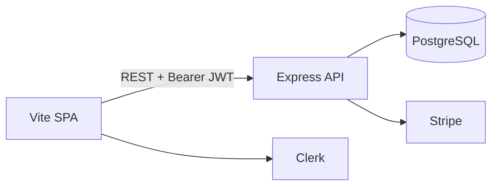

# Acme Platform (React/Vite + Express + Prisma)

Production-minded reference implementation: public marketing site, blog with PostgreSQL full-text search, memberships (Clerk), Stripe checkout and subscriptions, headless CMS admin, forms (React Hook Form + Zod), S3-ready media uploads, Resend email hooks, and SEO endpoints (sitemap/robots).

## Architecture

- **Frontend:** Vite + React 18 SPA, Tailwind CSS v4, React Router v7, Clerk React SDK, `react-helmet-async`, RHF + Zod (shared schemas from `@acme/shared`).
- **Backend:** Express 5 on Node, `@clerk/express` for JWT verification, Prisma 6 + PostgreSQL, Stripe + webhooks, Resend, AWS SDK v3 for S3 presigns.
- **Deploy:** Static `apps/web` to Vercel/Netlify; `apps/api` + Postgres to Railway/Render/Fly. Set `VITE_API_URL` to the public API origin in production (or put the API behind the same domain reverse proxy).

**Guest cart note:** the cart cookie is `SameSite=Lax` and is set by the API response. For guest checkout to work reliably, keep the browser on the **same site** as the API (reverse proxy `/api` → backend) or evolve the cart to use explicit guest tokens in `localStorage` + API headers.



## Local setup

1. **PostgreSQL** — create database `acme` (or adjust URL).

2. **Environment files**

   - Copy [`apps/api/.env.example`](apps/api/.env.example) to `apps/api/.env` and fill Clerk keys + `DATABASE_URL`.
   - Copy [`apps/web/.env.example`](apps/web/.env.example) to `apps/web/.env` and set `VITE_CLERK_PUBLISHABLE_KEY`.

3. **Install and migrate**

   ```bash
   npm install
   npm run build -w @acme/shared
   npm run db:generate -w @acme/api
   npm run db:migrate -w @acme/api   # or: npm run db:push -w @acme/api
   npm run db:seed -w @acme/api
   ```

4. **Run dev**

   ```bash
   npm run dev
   ```

   - Web: http://localhost:5173 (proxies `/api` → http://localhost:4000)
   - API: http://localhost:4000

   If `/api/site` or `/api/posts` returns **500**, check:

   - **Database:** create it if needed (`createdb acme` or your cloud URL), then `npm run db:migrate -w @acme/api` and `npm run db:seed -w @acme/api`.
   - **Clerk keys on the API:** placeholder keys (`replace_me`) are ignored: the API uses a **signed-out auth stub** so public routes work. Use real `pk_` / `sk_` keys from Clerk when you need JWT verification and `/api/me/*`.

5. **First admin user** — sign in once with Clerk, then in PostgreSQL set your `User.role` to `EDITOR`, `ADMIN`, or `SUPER_ADMIN`. After that, `/admin` is available.

6. **Clerk webhooks (optional)** — point a Clerk webhook to `https://<api-host>/api/webhooks/clerk` with `user.created` / `user.updated` / `user.deleted` to keep `User` rows in sync.

7. **Stripe (optional)** — set `STRIPE_SECRET_KEY` and `STRIPE_WEBHOOK_SECRET`; configure Checkout prices on `Plan` rows (`stripePriceMonthlyId` / `stripePriceYearlyId`) and product `stripePriceId` as needed. Webhook URL: `/api/webhooks/stripe`.

## Useful API paths

| Path | Purpose |
|------|---------|
| `GET /api/health` | Health check |
| `GET /api/site` | Site settings + navigation JSON |
| `GET /api/search?q=` | Full-text search (posts/pages/products) |
| `GET /api/seo/sitemap.xml` | Dynamic sitemap |
| `GET /api/seo/robots.txt` | robots.txt with sitemap pointer |

## Production readiness

| Ready | Scaffold / next steps |
|-------|-------------------------|
| Prisma schema, migrations, seed | Row-level security, backups |
| Clerk + role-gated admin | Org sync, fine-grained permissions UI |
| Stripe Checkout + webhooks | Tax, trials UI, dunning emails |
| Forms + rate limits | CAPTCHA (Turnstile), honeypot |
| S3 presign + `MediaAsset` | CDN, virus scan, image variants |
| FTS via SQL | Swap `searchAll` for Algolia/Meilisearch |

## Scripts

| Script | Description |
|--------|-------------|
| `npm run dev` | API + web concurrently |
| `npm run build` | shared + api + web production build |
| `npm run db:migrate` | Prisma migrate (from `@acme/api`) |
| `npm run db:seed` | Seed demo content |

## Repository layout

- [`apps/web`](apps/web) — Vite SPA
- [`apps/api`](apps/api) — Express API
- [`packages/shared`](packages/shared) — Zod schemas shared with API/web
- [`prisma`](prisma) — `schema.prisma`, `seed.ts`, SQL migrations

## License

Private / demo — adapt for your own policies.
